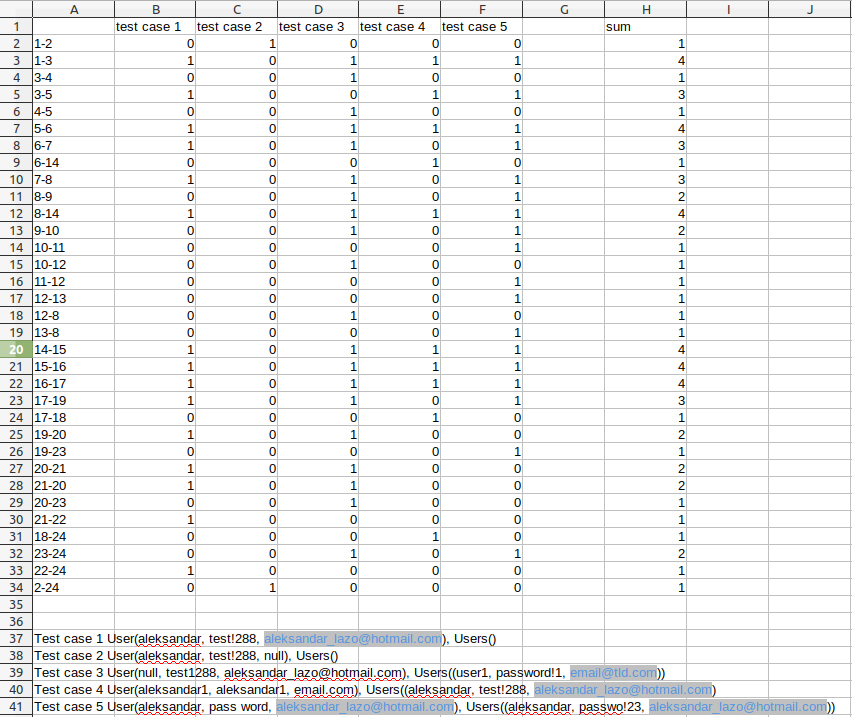
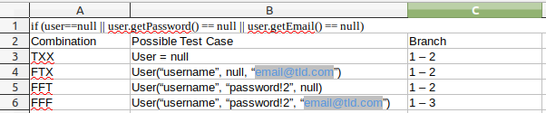

# Втора лабораториска вежба по Софтверско инженерство
## Александар Лазаревски, бр. на индекс 121074
### Control Flow Graph

### Цикломатска комплексност
Цикломатска комплексност може да се пресмета на три начина: според бројот на региони, V(G) = E - N + 2 или V(G) = P + 1.
Во нашиот случај Е е 33 а N е 24 па V(G) = 33 - 24 + 2 = 11
### Тест случаи според критериумот Every Branch

### Multiple-Condition Coverage

